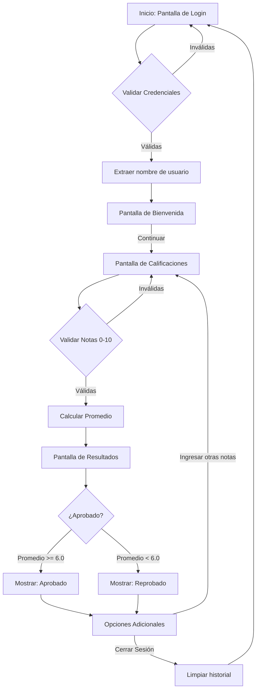

# Foro 1 - Desarrollo de Software para Móviles

## Información del Proyecto

**Universidad:** Universidad Don Bosco  
**Materia:** Desarrollo de Software para Móviles (DSM941)  
**Proyecto:** Foro 1 
**Grupo:** #3  
**Estudiante:** Isidro Alexander Marroquín Echeverría  
**Correo:** isidro.marroquin@udb.edu.sv  
**Carnet:** ME221443  
**Fecha:** Abril 2026

## Descripción del Proyecto

Este proyecto es una aplicación móvil nativa para Android que he desarrollado utilizando Kotlin y Jetpack Compose. Su propósito principal es demostrar la implementación de navegación entre diferentes pantallas utilizando la biblioteca de Navigation Compose, así como la gestión del estado a través de ViewModels. La aplicación simula un sistema de ingreso y cálculo de calificaciones.

## Arquitectura y Tecnologías

He diseñado esta aplicación siguiendo los principios de la arquitectura recomendada para Android, utilizando las siguientes herramientas:

- **Kotlin:** Lenguaje de programación principal.
- **Jetpack Compose:** Framework declarativo para la construcción de la interfaz de usuario.
- **Navigation Compose:** Para el manejo del enrutamiento y la transferencia de parámetros de forma segura entre pantallas.
- **ViewModel:** Para separar la lógica de negocio y el estado de la interfaz de usuario, asegurando que los datos sobrevivan a los cambios de configuración.

## Flujo de la Aplicación

A continuación, presento un diagrama que ilustra el flujo de pantallas y la toma de decisiones dentro de la aplicación:

La aplicación cuenta con un flujo de navegación estructurado en cuatro pantallas principales:

1. **Pantalla de Inicio de Sesión (Login):** Permite ingresar un correo electrónico y una contraseña. He implementado validación de credenciales a través de un ViewModel. Al iniciar sesión correctamente, extraigo el nombre de usuario del correo y lo paso como argumento a la siguiente pantalla.
2. **Pantalla de Bienvenida (Welcome):** Recibe el nombre de usuario como parámetro de navegación y presenta un mensaje de bienvenida personalizado. Sirve como punto de transición hacia la funcionalidad principal.
3. **Pantalla de Calificaciones (Grades):** Proporciona un formulario para ingresar tres notas en un rango de 0 a 10. El ViewModel asociado se encarga de validar que las entradas sean numéricas y se encuentren dentro del rango permitido antes de realizar el cálculo del promedio de las notas.
4. **Pantalla de Resultados (Result):** Recibe el nombre de usuario y el promedio calculado. Con esta información, determino si la nota es aprobatoria (mayor o igual a 6.0) o reprobatoria, mostrando el resultado en pantalla. Además, he incorporado opciones para regresar e ingresar nuevas notas o cerrar la sesión por completo, lo cual limpia el historial de navegación para evitar retornos no deseados.

## Instrucciones de Ejecución

Para ejecutar este código, es necesario abrir el directorio del proyecto con Android Studio. Se debe permitir que Gradle sincronice el proyecto y descargue las dependencias de Jetpack Compose y Navigation necesarias. Una vez finalizada la sincronización, el proyecto puede ser compilado y ejecutado en un emulador de Android o en un dispositivo físico.
